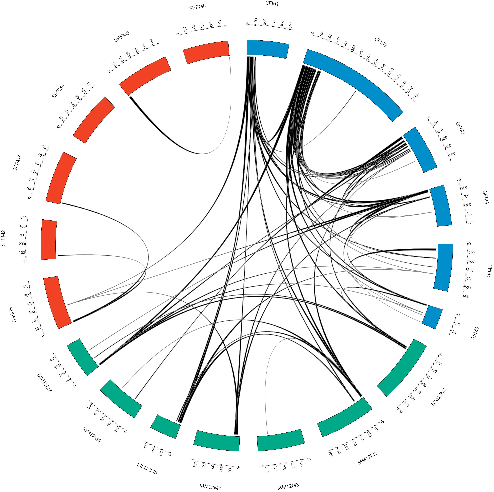
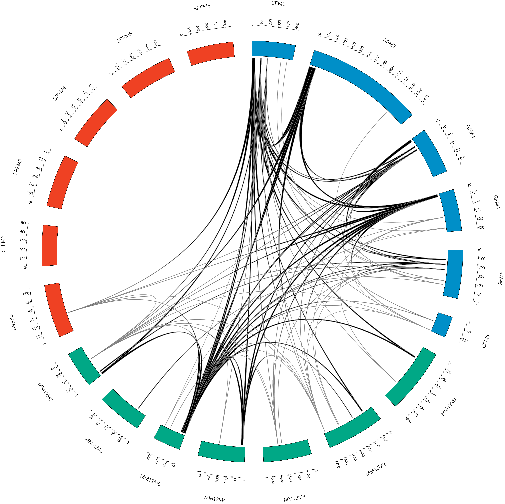

```{r Public Clone analysis}
##################################################################
#   ___       _     _ _          _               _           _     
#  / _ \_   _| |__ | (_) ___    /_\  _ __   __ _| |_   _ ___(_)___ 
# / /_)/ | | | '_ \| | |/ __|  //_\\| '_ \ / _` | | | | / __| / __|
#/ ___/| |_| | |_) | | | (__  /  _  \ | | | (_| | | |_| \__ \ \__ \
#\/     \__,_|_.__/|_|_|\___| \_/ \_/_| |_|\__,_|_|\__, |___/_|___/
#                                                  |___/           

##################################################################
```


Install easypackages manager
```{r}
if("easypackages" %in% rownames(installed.packages()) == F){
  install.packages("easypackages")
}
```

Load and install necessary packages
```{r}
library(easypackages)
pk <- c("Biostrings","yarrr", "tuple","dplyr","data.table","searchable","GDAtools","DT",
        "tidyverse","openxlsx","stringdist", "gtools","plotly", "readr", "scales", "CircosOut")
pki <- pk[!pk %in% rownames(installed.packages())]
easypackages::install_packages(pki)
libraries(pk)
```


```{r}
sulk.db <- readr::read_delim("dataset/public_4nt/4nt_Changeo.tab", delim = "\t")
```

Sorting clones and groupping based on CDR3_V_J_well
each unique sequence can only exist once within each well:

```{r}
sulk.db.one <- sulk.db %>% dplyr::group_by(JUNCTION_AA, VGENE, JGENE, PLATE_ID) %>% dplyr::summarise(number = n())  %>% arrange(desc(number))

sulk.db.one
```

Create the public clonotype database (themes), with identical VJ and 4nt separation in JUNCTION.
```{r}
sulk.db$aa_clone <- paste0(sulk.db$JUNCTION_AA,"_",sulk.db$CLONE)

sulk.db.kar <- sulk.db %>% group_by(MOUSE, CLONE) %>% summarise(Size = n(), JUNCTIONS = toString(JUNCTION_AA), VCALL = toString(V_CALL),VGENE = toString(VGENE), JGENE = toString(JGENE)) %>% arrange(desc(Size))


head(sulk.db.kar)
#saveRDS(sulk.db.kar, "results/sulk.db.kar.rds")
```

Number of themes
```{r}
nrow(sulk.db.kar)
```

#Remove themes that are present in a single well
```{r}
sulk.db.kar.more <- sulk.db.kar %>% filter (Size > 1)
saveRDS(sulk.db.kar.more, "results/sulk.db.kar.more.rds")
```

Number of themes, > 1 well
```{r}
nrow(sulk.db.kar.more)
```

```{r}
sulk.db.kar.more$CLONE_MOUSE <- paste0(sulk.db.kar.more$CLONE,"_",sulk.db.kar.more$MOUSE)
head(sulk.db.kar.more)
# split.sulk <- split(sulk.db.kar.more, f = sulk.db.kar.more$CLONE)
# head(split.sulk, 1)
# split.sulk <- split.sulk[names(nshar)]
# split.sulk
#write.table(x = link_sel, file = "4nt_link.selction.txt", quote = F, sep = " ")
#link_sel <- readr::read_delim("4nt_link.selction.txt", delim = " ")
```

```{r}
sulk.db.kar.more_split <- split(sulk.db.kar.more, f = sulk.db.kar.more$MOUSE)
```

The circos.karyotype function takes a dataframe list as input to build a fake karyotype-like file, following the circos format rules, to be used in the circos software. Each data frame, here all 19 mice used in this experiment, will become a chromossome-like entity. Morever, here we take advantage of the use of bands by circos, to describe chromossal bands, and use that to represent clonotypes (CDR3 = CLONE), of any size. A Size named column, with the size of each clonal entity, must be present. The circos.karyotype function should save a ready to use file for circos with an assembled karyotype-like design of your clonal data. The group parameter just points to the data frame split column.

```{r}
source("scripts/circos.karyotype.R")
```

```{r}
circos.karyotype(karyotype = sulk.db.kar.more_split, CDR3 = "CLONE", Group = "MOUSE", save = T, file.name = "results/forcircos/karyotype.txt")
```

The writebin function produces a null-terminated string on the last line of the file. I haven't seen circos complaining about it but I like to remove it anyways.

```{bash}
tr < results/forcircos/karyotype.txt -d '\000' > tmp && mv tmp results/forcircos/karyotype.txt
```

We read the karyotype file and extract band lines
```{r}
bands <- readr::read_delim("results/forcircos/karyotype.txt", delim = " ", col_names = F)
bands <- bands[grep("band", bands$X1, invert = F), ]
head(bands)
```

The links function will compare the clonotype IDs (CDR3 themes) between mice, finding the maximum clonotype sharing. Here we use the circos links or ribbons to guide us through the public CDR3 in the data. 

```{r}
source("scripts/links.R")
```

```{r}
links <- capture.output(links(bands = bands, CDR3 = "X3",Group = "X2", coord1 = "X5", coord2 = "X6"))
zz <- file("results/forcircos/links.txt", "wb")
  writeBin(paste(links, collapse = "\n"), zz)
  close(zz)
```

Clean the captured output using bash
```{bash}
cut -d '"' -f 2 results/forcircos/links.txt > tmp && mv tmp results/forcircos/links.txt
tr < results/forcircos/links.txt -d '\000' > tmp && mv tmp results/forcircos/links.txt
grep -v NULL results/forcircos/links.txt > tmp && mv tmp results/forcircos/links.txt
#
#sed -e :a -e '$d;N;2,1ba' -e 'P;D' results/forcircos/links.txt > tmp && mv tmp results/forcircos/links.txt
```

The karyotype and links files are necessary to generate a image like this. The circos folder contains the necessary configuration files to generate the circos image. Check how to use and install circos at http://circos.ca/.

```{r , echo=FALSE, out.width = '30%%'}
knitr::include_graphics("circos/1_4nt/plots/circos.png")
```

Circos allow us to add a metadata column in the links file that are very useful to various manipulations like filtering or color changing based on different criteria. Here we added to the links.txt a variable color based on clonal links that contain at least 1 CDR3 with exact matches. Using the circos.conf file, we can add a rule to filter out non-identical matches.

```{bash}
head circos/2_Exact/data/links.txt
```

```{r , echo=FALSE, out.width = '30%%'}

```

We can also add a rule in circos to display only the links that the sum of both ends are bigger than 30.
It looks like this:
```{r}
#<rule>
#tag = sizes
#condition  = var(size1) + var(size2) < 30
#show = no
#flow = continue
#</rule>
```

```{r , echo=FALSE, out.width = '30%'}

```

Later we display only the clonotype sharing that are V1-47-CARGSNY:


```{r , echo=FALSE, out.width = '30%'}

```

And we also display only the clonotype sharing that are V1-12-CAREGFAY:


```{r , echo=FALSE, out.width = '30%'}
knitr::include_graphics("circos/5_AREGFAY/plots/circos.png")
```


